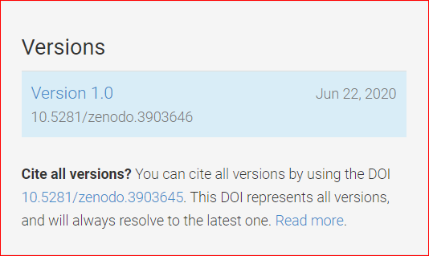

# Open Science Lens Browser Plugin User Manual (OSL Plugin User Manual)

## List of OSL functions:

### Scanning the DOM:

There are multiple ways to scan the DOM (manually, automatically or on pane load), all of witch have the effect of going from the 1st image to the 2nd.

### Clearing the DOM:

Clearing the DOM can be done by clicking on the "Clear" button and has the effect of going from the 1st image to the 2nd.

### Highlight and search OpenAIRE:

Highlight a certain word or phrase and right click on it. Then click on the option "Explore OpenAIRE". It will open a new tab on the "explore.openaire.eu" website with the search term you have highlighted.

### Visit OpenAIRE:

In the side panel to the right by clicking the button "Visit OpenAIRE" it will open a new tab and take you to the "www.openaire.eu" website.

### Visit Open Science Lens Github repository:

In the side panel to the right by clicking the button "Embed Open Science Lens to your page" it will open a new tab and take you to the "github.com/cite-sa/open-science-lens" website where you will find information about the Open Science Lens Widget.

### Read description:

In the side panel to the right by clicking the button "How Open Science Lens Works" it will change the view and take you to a brief summary about Open Science Lens.

### DOI in side panel:

By clicking on the DOI in the side panel you see the general information that is available to you through OpenAIRE and further more you can click on the sliders to access the value of that information.

### DOI in the DOM:

Similarly by clicking on the DOI badge on the DOM you see the general information that is available to you through OpenAIRE and further more you can click on the sliders to access the value of that information.

### Plugin Settings:

By clicking the gear on the top right of the side panel you will be lead to the settings page.

By clicking the desired category a list will open with the available settings. There are two types of settings: "general" and "other" with "other" being a filter mechanism for each type of doi.

General settings:

There are three available types of settings: Language, AutoScan and Show Badge.

* Language:
  * English

* AutoScan: 
  * Manual: you have to click the "Scan" button.
  * Auto: scans at certain intervals.
  * On Page Load: scans once automatically when page loads.

* Show Badge:
  * On (1st + 2nd image)
  * Off (3rd + 4th image)

Other settings:

There are five available types of settings:

* Dataset
* Publication
* Software
* Project
* Other

Each of them controls what is shown for each type. (example shown is for Dataset)

### Login

Clicking the "Login" button will open a new tab with the Open Science Lens WebApp for the user to log in. Once logged in it will show the user's name.

