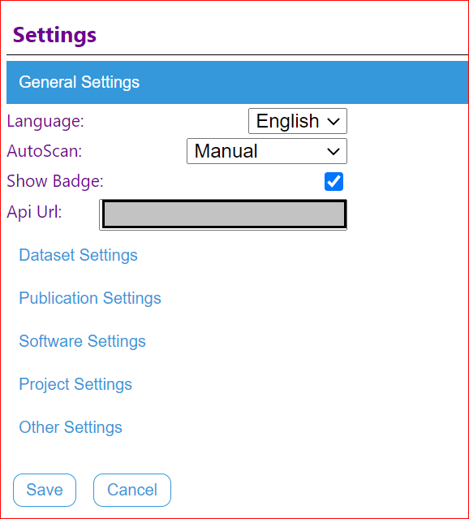
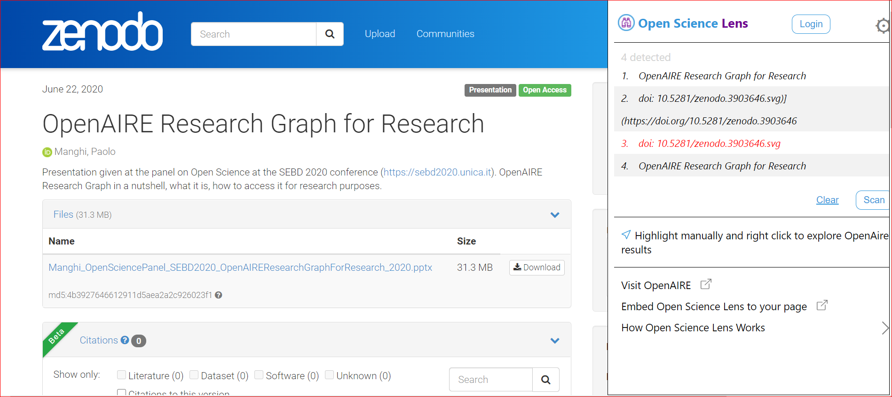
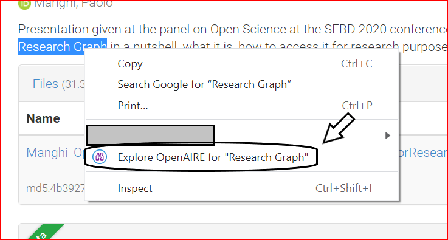

# Open Science Lens Browser Plugin User Manual

## Installing the Plugin:

* After you have downloaded the plugin:
  * click on the extension button in the top right corner of your Chrome browser.  
  
  * Then click on the pin to make it visible, next to your search bar.  

## Plugin Settings:

By clicking the gear on the top right of the side panel you will be lead to the settings page.  

By clicking the desired category a list will open with the available settings. There are two types of settings: "general" and "other" with "other" being a filter mechanism for each type of doi.

General settings:  

There are three available types of settings: Language, AutoScan and Show Badge.  
* Language:
  * English

* AutoScan:  
  * Manual: you have to click the "Scan" button.
  * Auto: scans at certain intervals.
  * On Page Load: scans once automatically when page loads.

  

* Show Badge:
	Show badge is a settings that allows a user to access the desirable DOI only through the list on the side panel. That way there is no externeal infulence on the website.
  * On  
	
  * Off  
	

Other settings:

There are five available types of settings:

* Dataset
* Publication
* Software
* Project
* Other

Each of them controls what is shown for each type. (example shown is for Dataset)

## Login

Clicking the "Login" button will open a new tab with the Open Science Lens WebApp for the user to log in. Once logged in it will show the user's name.

  

## Scanning:

There are multiple ways to scan (manually, automatically or on page load) resulting in:
* a list in the side panel  
  
* possible badges on the website.  

## Clearing:

Clear can be done by clicking on the "Clear" button and can be used to clean the side panel and the website from all the available information if the user doesn't want to see it.  

## Highlight and search OpenAIRE:

Highlight a certain word or phrase and right click on it. Then click on the option "Explore OpenAIRE". It will open a new tab on the OpenAIRE website with the search term you have highlighted.  

## Visit OpenAIRE:

In the side panel by clicking the button "Visit OpenAIRE" it will open a new tab and take you to the OpenAIRE website.  

## Visit Open Science Lens Github repository:

In the side panel by clicking the button "Embed Open Science Lens to your page" it will open a new tab and take you to the Github repository where you will find information about the Open Science Lens Widget.  

## DOI in side panel:

By clicking on the DOI in the side panel you see the general information that is available to you through OpenAIRE and further more you can click on the sliders to access the value of that information.  

## DOI and Badges:

Similarly by clicking on a badge next to the DOI you want, you'll see the general information that is available to you through OpenAIRE and further more you can click on the sliders to access the value of that information.  
  

## Widget Blocker:

If there is both a plugin installed and activated and a widget in a website, depending on the widget settings, the widget might not allow the plugin to scan.  
<!--  -->
