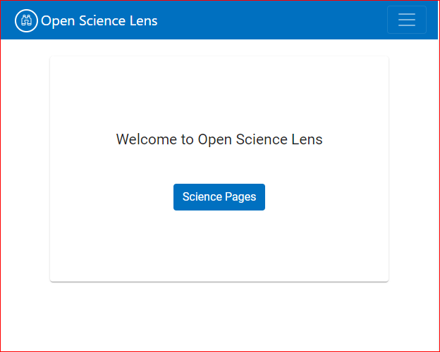

# Open Science Lens Browser Web App User Manual

## Login:

## Scientific Pages:

By clicking the "Scientific Pages" button you are redirected to the main scientific page list.

Logging in can be done two ways:

* As a general user. The general user can only see the requests he is responsible for.

* As an administrator. The administrator can do more things than the general user:
  * See all the requests and take certain actions (approve, reject).

  * Clear the cache.  

There is also a search function on the top of the list:
* Search by text  

* Search by status  

## New Registration

By clicking on "Add Registration" you can make a new Scientific Page.  

When adding a new registration you have certain fields to fill out:  

* Domain (has to be a certain type ex: https://www.madgik.di.uoa.gr):  

* Email (has to be a certain type ex: thisisafakeemail@fake.fake):  

* Settings:
  * General:  

	* Language (Dropdown)
	* Button Color (Dropdown)
	* Position (Dropdown)
	* Scanning (Dropdown)
	  * manual
	  * auto
	  * on page load
	  * none  
	    
	* Theme (Dropdown)
	* Max Size
	* Deactivate Plugin (Checkbox)
	* Badge (Checkbox)
	* Markup Badge (Checkbox)
	* Additional Markup Info (Checkbox)
	* Additional DOI Info (Checkbox)
	* Additional DOI Info Title (Checkbox)

  * Others:  
	The rest of the settings are checkboxes controlling what to show for each different type of result. You can access these settings by clicking on the buttons to the left.  
	  
    * Dataset
	* Publication
	* Software
	* Project
	* Other

After saving, the request is pending and you have to wait for it to be approved by an administrator. Even before being approved you can download the settings you have selected as a JSON file or even copy the API key you will be using.  
  
After being approved you can also edit the details you have input or ask for a new API key.  

