# Open Science Lens Browser Widget User Manual (OSL Widget User Manual)

## List of OSL functions:

### Scanning the DOM:

There are multiple ways to scan the DOM (manually, automatically or on pane load), all of witch have the effect of going from the 1st image to the 2nd.

### Clearing the DOM:

Clearing the DOM can be done by clicking on the "Clear" button and has the effect of going from the 1st image to the 2nd.

### Highlight and search OpenAIRE:

Highlight a certain word or phrase and click on the option "Search Highlighted". It will search the "explore.openaire.eu" website and return the top results of that search.

### Visit OpenAIRE:

In the popup panel to the right by clicking the button "Visit OpenAIRE" it will open a new tab and take you to the "www.openaire.eu" website.

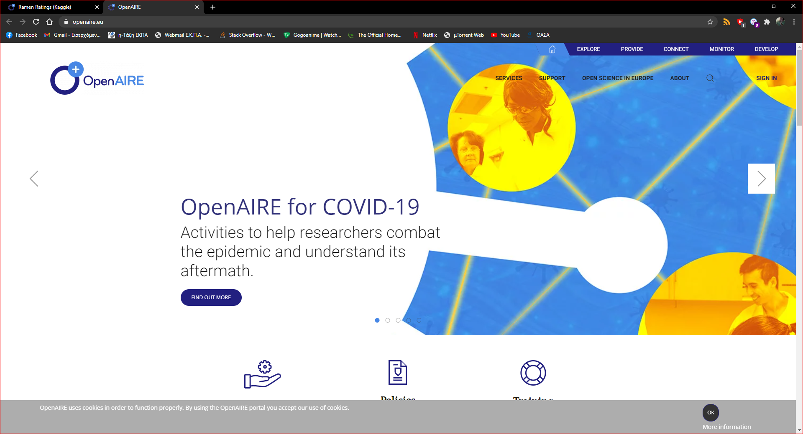

### Visit Open Science Lens Github repository:

In the popup panel to the right by clicking the button "Embed Open Science Lens to your page" it will open a new tab and take you to the "github.com/cite-sa/open-science-lens" website where you will find information about the Open Science Lens Widget.

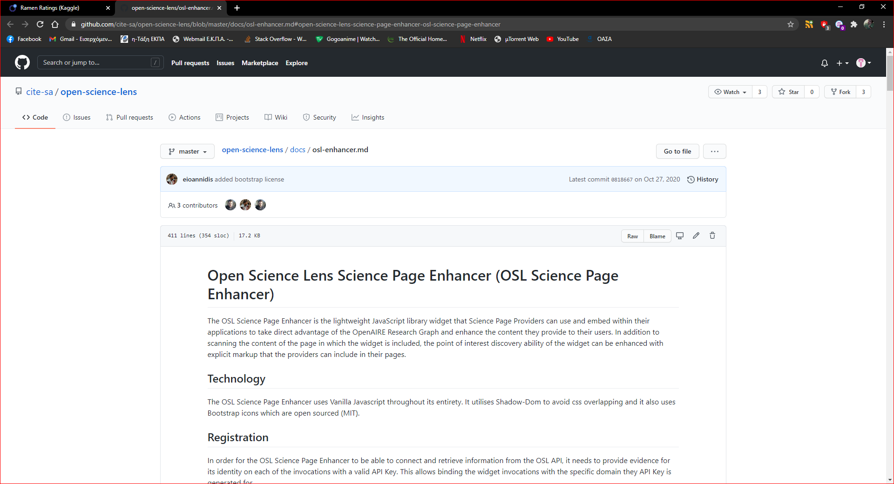

### Read description:

In the popup panel to the right by clicking the button "How Open Science Lens Works" it will change the view and take you to a brief summary about Open Science Lens.

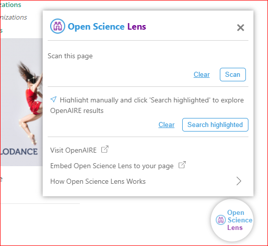

### DOI in popup panel:

By clicking on the DOI in the popup panel you see the general information that is available to you through OpenAIRE and further more you can click on the sliders to access the value of that information.

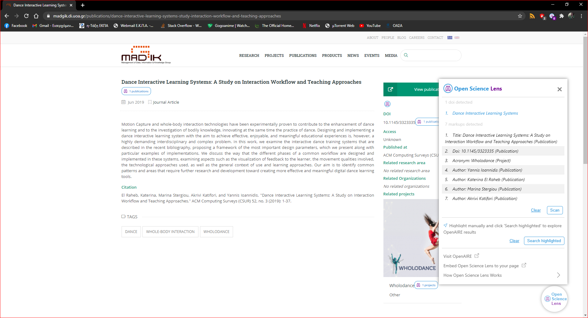

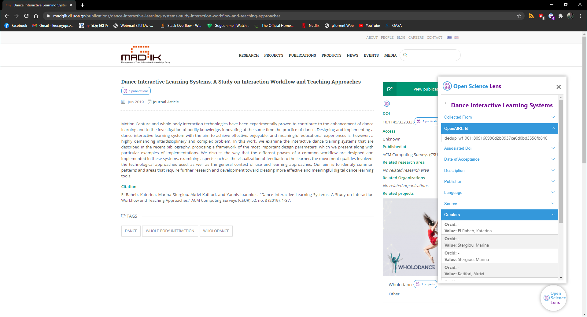

There are also markups results that when opened present a list of search results.

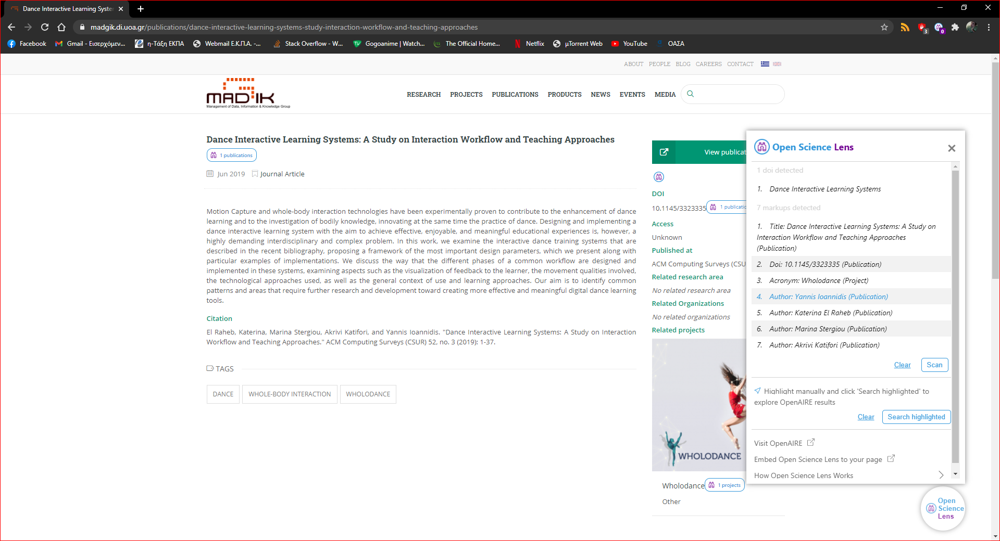
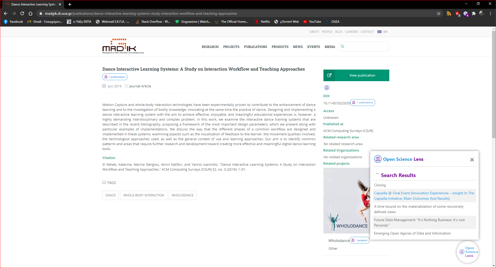
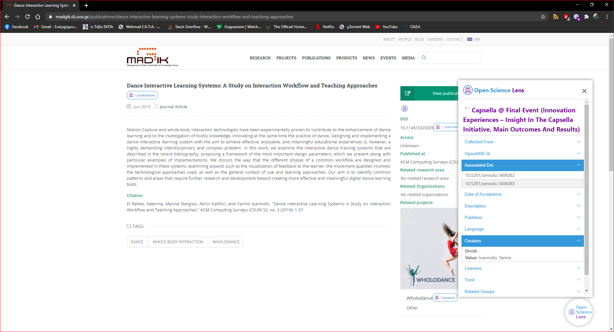

### DOI in the DOM:

Similarly by clicking on the DOI badge on the DOM you see the general information that is available to you through OpenAIRE and further more you can click on the sliders to access the value of that information.

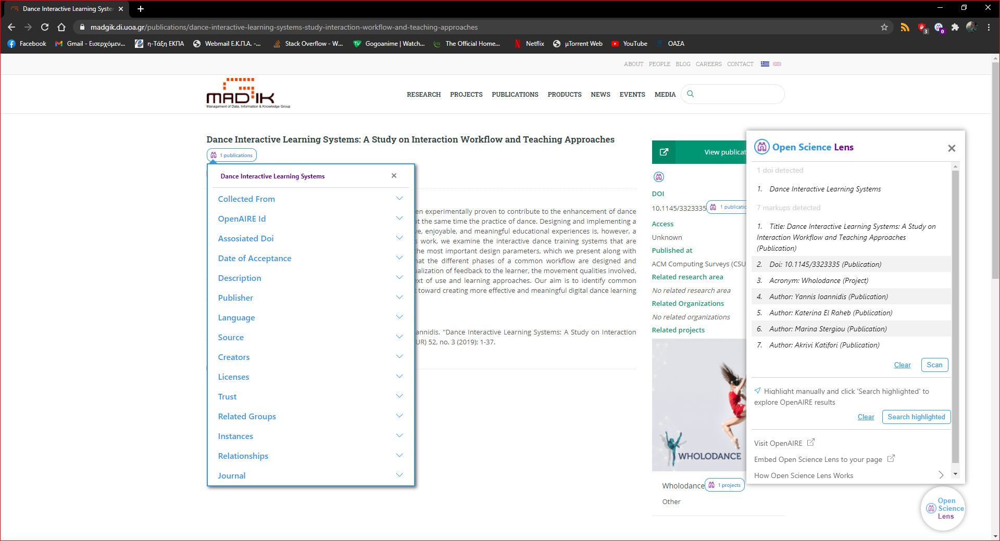
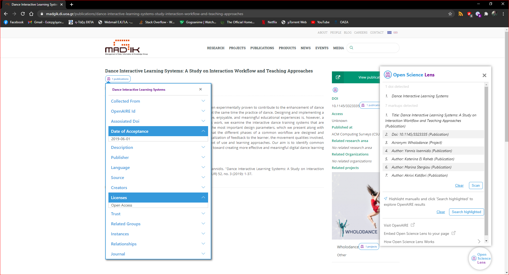

Similarly there are also markup results that when opened present a list of search results.

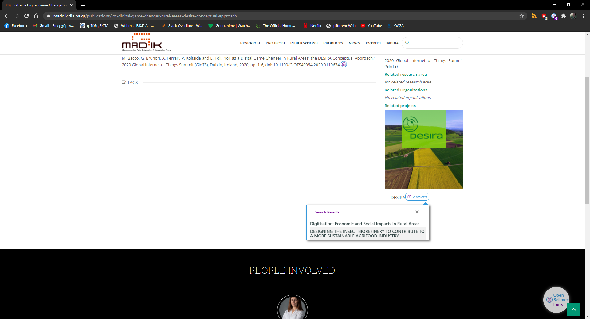
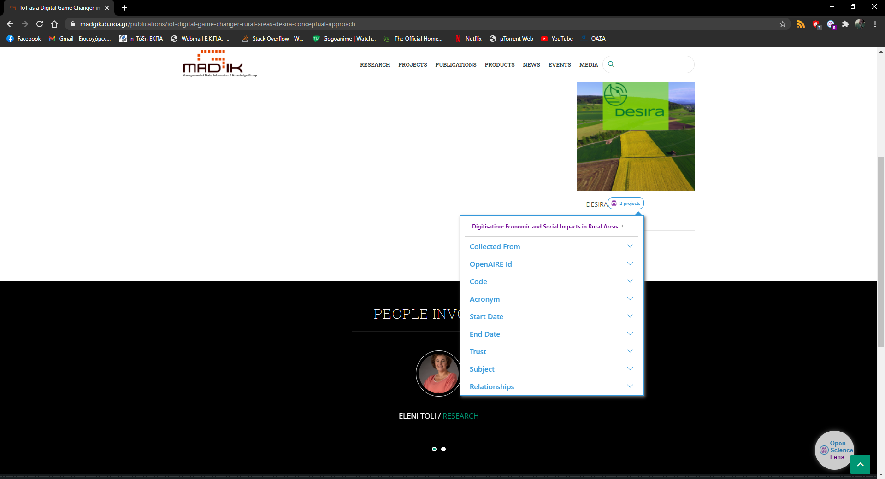
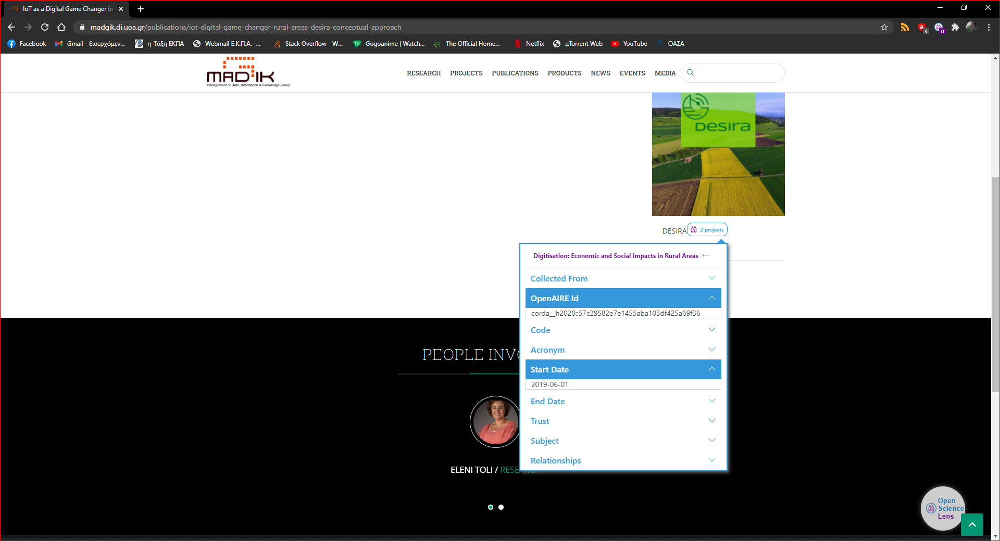