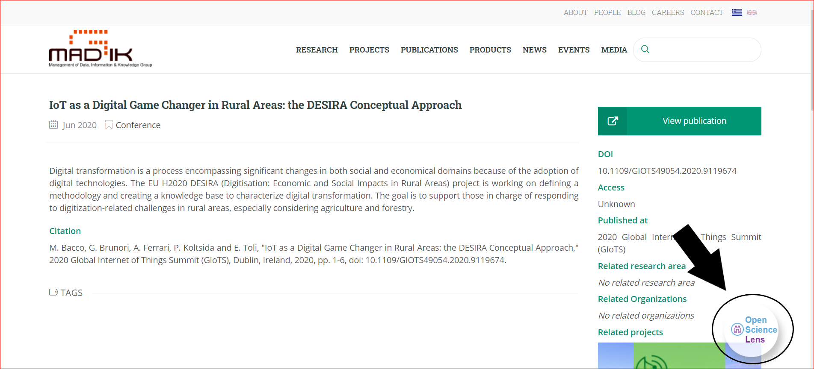
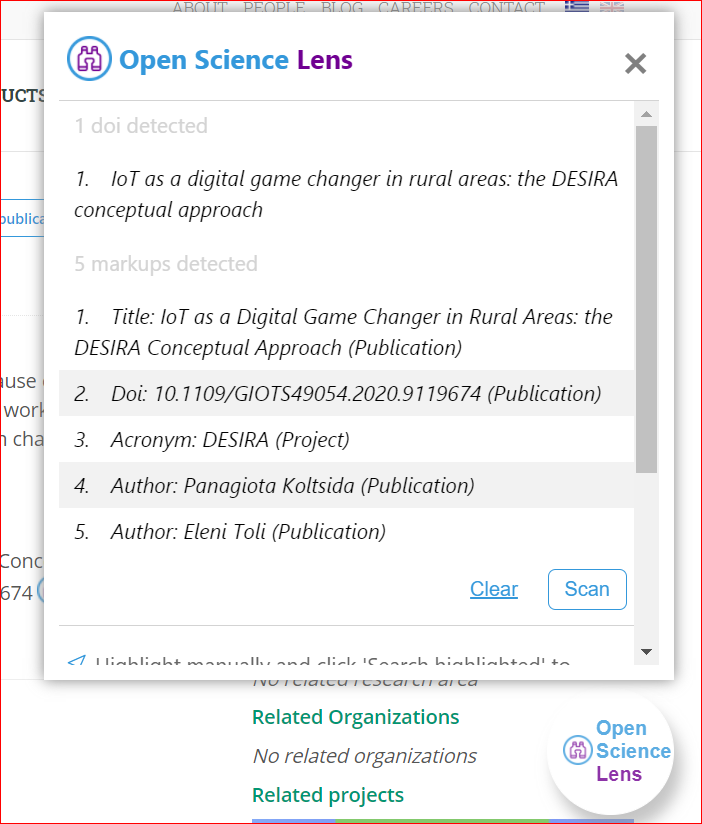
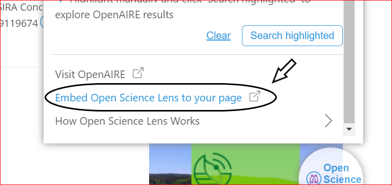

# Open Science Lens Browser Widget User Manual

## Widget Operation:

To open the widget, click on the "Open Science Lens" button.  

## Scanning:

There are multiple ways to scan (manually, automatically or on pane load) resulting in:
* a list in the popup.  

* possible badges on the website.  

## Clearing:

Clear can be done by clicking on the "Clear" button and can be used to clean the popup and the website from all the available information if the user doesn't want to see it.  

## Highlight and search OpenAIRE:

Highlight a certain word or phrase and click on the option "Search Highlighted". It will:
*  search the OpenAIRE website:  

*  return the top results of that search:    

*  you can also clear the list:    

## Visit OpenAIRE:

In the popup by clicking the button "Visit OpenAIRE" it will open a new tab and take you to the OpenAIRE website.  

## Visit Open Science Lens Github repository:

In the popup by clicking the button "Embed Open Science Lens to your page" it will open a new tab and take you to the Github repository where you will find information about the Open Science Lens Widget.  

## DOI in popup:

By clicking on the DOI in the popup you see the general information that is available to you through OpenAIRE and further more you can click on the sliders to access the value of that information.  

There are also markups results that when opened present a list of search results.  

## DOI and Badges:

Similarly by clicking on a badge next to the DOI you want, you'll see the general information that is available to you through OpenAIRE and further more you can click on the sliders to access the value of that information.  

Similarly there are also markup results that when opened present a list of search results.  
